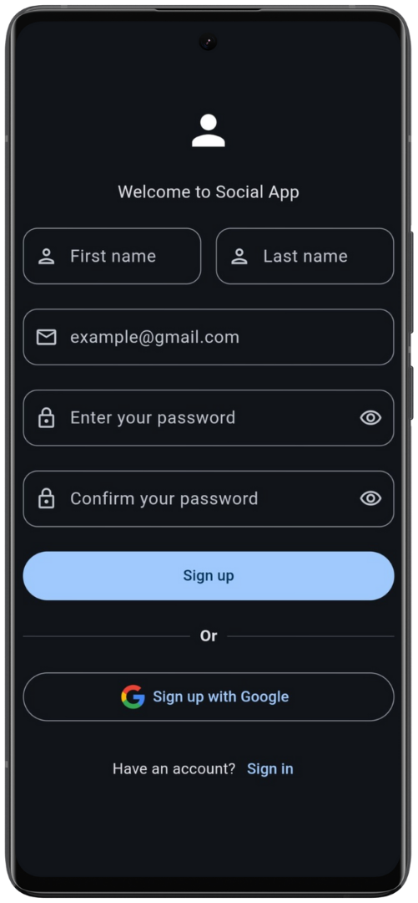
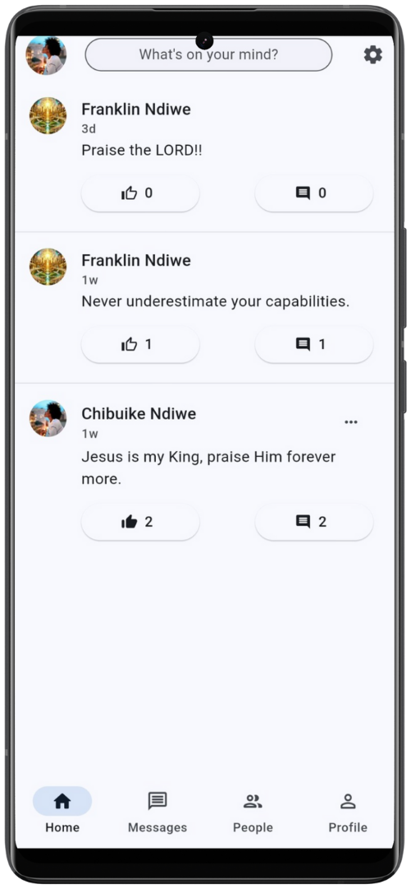
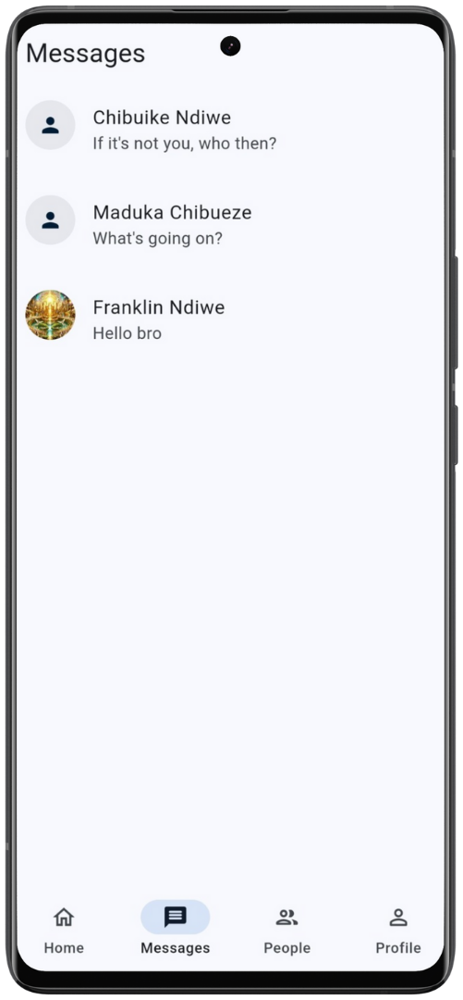
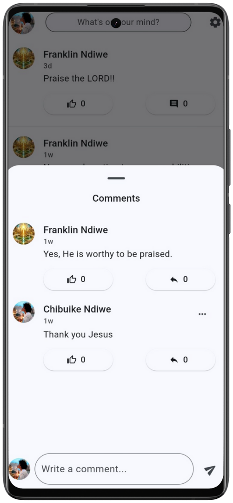
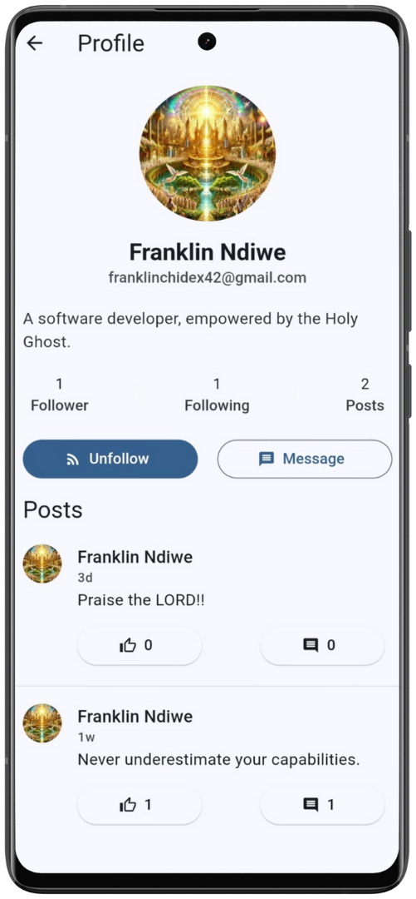
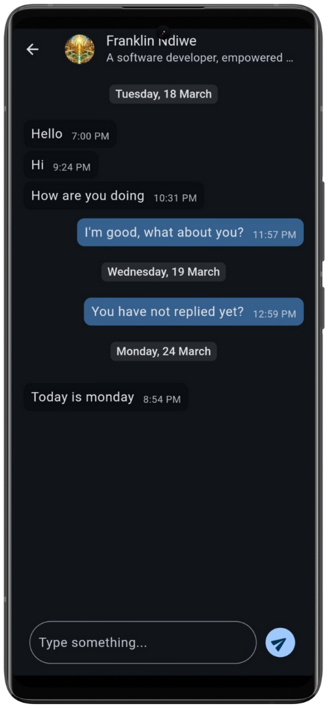

# chat_app

A Social Application.

## About

A simple social application built to try out Flutter and also level up my experience in Mobile App Development.

## Features

1. View posts from following and share contents to followers.

2. Get chats and messages in realtime, also display unread messages.

3. Switch between light and dark mode.

## Screenshots

### Signup screen

### Home screen

### Messages screen

### Comments section

### Profile screen

### Chat screen

